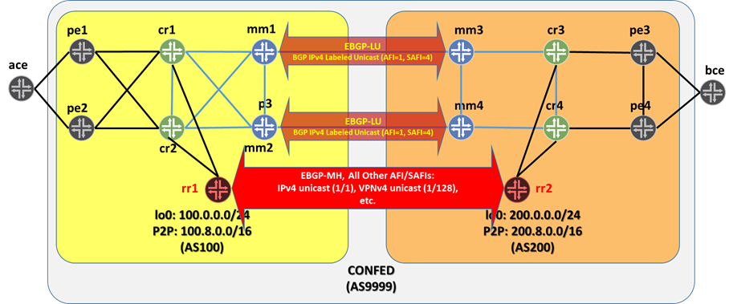

# Inter-AS VPN Option C

</img>

Three ways to configure Inter-AS VPN Option C:

* **rib-groups** - the classical and mostly used and Juniper-recommended method:
    * RIB inet.3 is used for for MPLS VPN next-hop (NH) resolution
    * We copy router loopbacks into inet.3 and advertise them via BGP-LU using inet.3
    * inet-unicast and inet-labeled-unicast MAY be used on the same BGP session, since they use different RIBs:
        * inet-unicast uses inet.0
        * inet-labeled-unicast uses inet.3
    * We leave LDP and MPLS configurations as-is.
    * **All MPLS services work**
    * RR configured with MPLS and LDP.

* **resolve-vpn** - optional method, sometimes shows to converge quicker (e.g. when Internet GRT is used within VRFs):
    * RIB inet.3 is used for for MPLS VPN next-hop (NH) resolution
    * BGP-LU uses by default inet.0, so we add **resolve-vpn** knob  
    * inet-unicast cannot be used along with inet-labeled-unicast on the same session, so it must be removed.
    * **All MPLS services work**
    * RR configured **without** MPLS and LDP.

* **resolution-ribs** - third method, uses **resolution-ribs** knob to resolve all MPLS L2/L3 VPNs from inet.0:
    * RIB inet.0 is used for for MPLS VPN next-hop (NH) resolution
    * BGP-LU uses by default inet.0, so we don't need to add anything there.
    * MPLS needs to be instructed to use inet.0 only, using **bgp-igp** knob under [edit protocols mpls traffic-engineering] stanza.
    * **ONLY Inter-AS MPLS L3 VPNs and VPLS work (other services don't work)!**
    * RR configured **without** MPLS and LDP.

